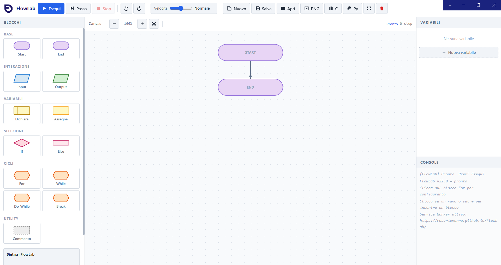
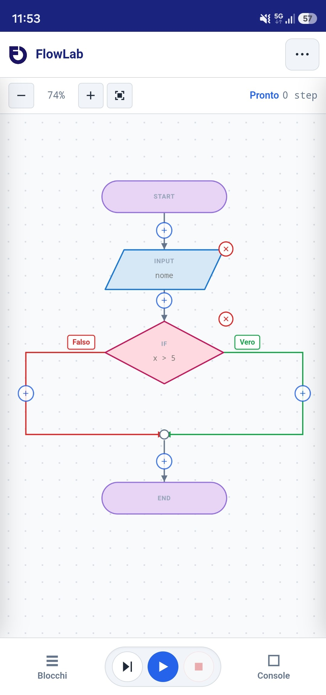

<div align="center">


# FlowLab

**Editor visuale di flowchart con esecuzione in tempo reale, variabili tipizzate, generazione di codice C e Python.**

Un ambiente di programmazione visuale ispirato a Flowgorithm, completamente riscritto in tecnologie web moderne.

[](https://web.dev/progressive-web-apps/)
[](https://developer.mozilla.org/en-US/docs/Web/JavaScript)
[](#)
[](#)

</div>

---

## Indice

- [Cos'è FlowLab](#cosè-flowlab)
- [Funzionalità](#funzionalità)
- [Screenshot](#screenshot)
- [Demo](#demo)
- [Installazione](#installazione)
- [Come si usa](#come-si-usa)
- [Sintassi del linguaggio](#sintassi-del-linguaggio)
- [Blocchi disponibili](#blocchi-disponibili)
- [Formato file `.fl`](#formato-file-fl)
- [Generazione di codice](#generazione-di-codice)
- [Struttura del progetto](#struttura-del-progetto)
- [Architettura tecnica](#architettura-tecnica)
- [Compatibilità](#compatibilità)
- [Roadmap](#roadmap)
- [Contribuire](#contribuire)
- [Credits](#credits)

---

## Cos'è FlowLab

**FlowLab** è un'applicazione web progressiva (PWA) che permette di creare, modificare ed eseguire **diagrammi di flusso** direttamente dal browser, senza installare nulla.

È pensato per:

- **Studenti** che imparano i fondamenti della programmazione (variabili, cicli, condizioni, funzioni)
- **Insegnanti** che vogliono uno strumento semplice per spiegare gli algoritmi
- **Chiunque** voglia visualizzare la logica di un programma prima di scriverlo in codice

A differenza di Flowgorithm (Windows-only), FlowLab funziona ovunque: **desktop, tablet e smartphone**, anche **senza connessione internet** dopo il primo caricamento.

---

## Funzionalità

### Editor visuale
- **Drag & drop** fluido dei blocchi sul canvas
- **Layout automatico verticale** con collegamenti ortogonali (angoli a 90°)
- **Forme elementari** per ogni tipo di blocco: ovale, rettangolo, rombo, parallelogramma, esagono
- **Colori distintivi** per categoria (Flowgorithm-style)
- **Auto-sizing**: i blocchi si adattano al contenuto
- **Zoom centrato** con pulsanti `+`/`−` e pinch-to-zoom a due dita su mobile
- **Indentazione visiva** per rami e cicli

### Blocchi supportati
- `Start` / `End` — Inizio e fine (obbligatori, non eliminabili)
- `Dichiarazione` — Con popup di scelta tipo (Integer, Real, String, Boolean, Character)
- `Input` / `Output` — Interazione con l'utente
- `Assegna` — Assegnazione di variabili
- `If` — Selezione singola/doppia con rami Vero/Falso
- `For` / `While` / `Do-While` — Cicli con popup di configurazione
- `Break` — Interruzione ciclo
- `Commento` — Annotazioni

### Rami e cicli
- **Rami Vero/Falso** con colori distintivi (verde/rosso)
- **Auto-creazione del ramo Else** quando serve
- **Merge automatico** al termine di ogni ramo
- **Loop-back** visivamente collegato al vertice del blocco ciclo
- **Pulsanti `+`** su ogni collegamento per inserire nuovi blocchi

### Variabili e tipi
- 5 tipi di dato: `Integer`, `Real`, `String`, `Boolean`, `Character`
- Pannello variabili con valori in tempo reale durante l'esecuzione
- Coercizione automatica dei tipi
- Rinomina automatica quando cambi il nome nel blocco `Dichiarazione`

### Esecuzione
- **Esegui tutto** con velocità regolabile (5 livelli: da Lenta a Turbo)
- **Passo passo** per il debug
- **Stop** per interrompere
- **Highlight del blocco corrente** con scroll automatico
- **Console integrata** stile chat con input/output colorati
- **Validazione** di variabili non definite, sintassi errata, indici fuori range

### Salvataggio e persistenza
- **Auto-salvataggio** su `localStorage` ad ogni modifica
- **Salva/Apri file `.fl`** con File System Access API (salva direttamente, senza riaprire il selettore la seconda volta)
- **Esporta PNG** dell'area di lavoro
- **Import/Export JSON** del progetto
- **Indicatore "modifiche non salvate"** con pallino rosso

### Generazione di codice
- **Codice C** completo con `#include`, `scanf`, `printf`, tipi corretti
- **Codice Python 3** con `input()`, `print()`, `range()`, gestione tipi
- Pulsante **Copia** e **Scarica** per ogni linguaggio

### PWA e mobile
- **Installabile** su Android, iOS, Windows, macOS, Linux
- **Funziona offline** dopo il primo caricamento (Service Worker)
- **Responsive** completo: adattamento automatico da desktop a smartphone
- **Menu mobile** con tutte le azioni raggruppate
- **Pannelli drawer** (Blocchi e Console) esclusivi su mobile
- **Touch-friendly**: pulsanti ≥ 40px, gesture pinch-zoom

### Extra
- **Undo/Redo** con storia di 60 stati
- **Scorciatoie da tastiera** (Ctrl+S, Ctrl+Z, Ctrl+Y, Ctrl+N, Ctrl+Enter, F10)
- **Modalità schermo intero**
- **Tema scuro** con accenti neon
- **Nessuna dipendenza esterna** — tutto vanilla JS

---

## Screenshot

> _Sostituisci con le tue immagini reali_

| Desktop | Mobile |
|---|---|
|  |  |

---

## Demo

> **Demo live**: [https://rosariomarra.github.io/FlowLab/](https://rosariomarra.github.io/FlowLab/)

_Se hai pubblicato l'app su GitHub Pages, aggiungi il link qui._

---

## Installazione

### Opzione 1 — Usa l'app online

Apri il link della [demo live](#demo). Non serve installare nulla.

### Opzione 2 — Installa come PWA

1. Apri FlowLab nel browser
2. Clicca l'icona **Installa** nella barra degli indirizzi (Chrome/Edge)
3. Su **iOS Safari**: `Condividi` → `Aggiungi a Home`
4. Su **Android Chrome**: menu `⋮` → `Installa app`

L'app verrà aggiunta alla home come un'app nativa.

### Opzione 3 — Sviluppo locale

```bash
# 1. Clona il repository
git clone https://github.com/rosariomarra/FlowLab.git
cd FlowLab

# 2. Avvia un server locale
# Con Python:
python3 -m http.server 8000

# Con Node.js:
npx serve

# Con VS Code: estensione "Live Server"

# 3. Apri il browser
# http://localhost:8000
```

> Il Service Worker richiede **HTTPS** o **localhost**. Non funziona aprendo `index.html` direttamente con doppio click.

---

## Come si usa

### 1. Crea il tuo primo flowchart

1. All'avvio trovi già **Start** e **End** collegati
2. Clicca sul **`+`** tra i due blocchi
3. Scegli un blocco dalla categoria (es. `Dichiarazione`)
4. Scrivi il contenuto nel blocco (es. `Integer x = 5`)
5. Ripeti per aggiungere altri blocchi

### 2. Esegui il programma

- **Esegui** — esegue tutto dall'inizio alla fine
- **Passo** — esegue un blocco alla volta (debug)
- **Stop** — interrompe l'esecuzione
- **Velocità** — regola la velocità da Lenta a Turbo

### 3. Esporta

- **C** → genera codice C
- **Py** → genera codice Python
- **PNG** → esporta il diagramma come immagine
- **Salva** → salva il progetto in `.fl`

### 4. Salva il progetto

- La **prima volta** ti chiede dove salvare
- Le **volte successive** salva direttamente nello stesso file
- **Nuovo** → resetta e chiede di nuovo il file la prossima volta

---

## Sintassi del linguaggio

FlowLab usa una sintassi **semplice e leggibile**, ispirata a Flowgorithm.

### Dichiarazione di variabili

```flowlab
Integer numero
Real prezzo = 12.50
String nome = "Mario"
Boolean trovato = true
Character iniziale = "A"
```

### Assegnazione

```flowlab
numero = 10
somma = a + b
media = somma / 3
numero++      ' incremento
numero--      ' decremento
```

### Input / Output

```flowlab
Input numero
Output numero
Output "Ciao"
Output "Il valore è " & numero
```

> **Nota sull'operatore `&`** — FlowLab usa `&` per la **concatenazione di stringhe** (come in Flowgorithm), non per l'AND logico. L'AND logico è `AND`.

### Operatori

| Categoria | Operatori |
|---|---|
| Aritmetica | `+` `-` `*` `/` `%` |
| Confronto | `==` `!=` `<` `>` `<=` `>=` |
| Logica | `AND` `OR` `NOT` |

### Condizioni

```flowlab
If numero > 5
  Output "Grande"
Else
  Output "Piccolo"
End If
```

### Cicli

```flowlab
' For con incremento
For i = 0 To 10
  Output i
End For

' For con decremento e passo
For i = 10 To 0 Step -2
  Output i
End For

' While
While numero < 10
  numero = numero + 1
End While

' Do-While (corpo eseguito almeno una volta)
Do
  Input numero
While numero < 0
```

### Commenti

```flowlab
' Questo è un commento
```

---

## Blocchi disponibili

| Categoria | Blocco | Forma | Descrizione |
|---|---|---|---|
| **Base** | Start | Ovale | Inizio del programma |
| | End | Ovale | Fine del programma |
| **Interazione** | Input | Parallelogramma | Legge un valore dall'utente |
| | Output | Parallelogramma | Mostra un valore |
| **Variabili** | Dichiara | Rettangolo tratteggiato | Dichiara una variabile con tipo |
| | Assegna | Rettangolo | Assegna un valore |
| **Selezione** | If | Rombo | Condizione Vero/Falso |
| | Else | Marker | Ramo alternativo |
| **Cicli** | For | Esagono | Ciclo enumerativo |
| | While | Esagono | Ciclo con condizione iniziale |
| | Do-While | Esagono | Ciclo con condizione finale |
| | Break | Esagono | Interrompe il ciclo |
| **Utility** | Commento | Nota | Annotazione |

---

## Formato file `.fl`

I progetti FlowLab sono salvati in **JSON** con estensione `.fl`:

```json
{
  "app": "FlowLab",
  "format": "flowlab",
  "version": "23.0",
  "savedAt": "2026-01-15T10:30:00.000Z",
  "nodes": [
    { "id": "abc123", "type": "start", "text": "" },
    { "id": "def456", "type": "declare", "text": "x", "declareType": "Integer" },
    { "id": "ghi789", "type": "assign", "text": "x = 10" },
    { "id": "jkl012", "type": "end", "text": "" }
  ],
  "varDefs": {
    "x": { "type": "Integer", "default": 0 }
  }
}
```

### Proprietà dei nodi

| Campo | Descrizione |
|---|---|
| `id` | Identificativo univoco |
| `type` | Tipo di blocco (`start`, `end`, `declare`, `assign`, `input`, `output`, `if`, `else`, `endif`, `for`, `while`, `dowhile`, `endloop`, `break`, `comment`) |
| `text` | Contenuto testuale del blocco |
| `declareType` | (solo per `declare`) Tipo della variabile |
| `forData` | (solo per `for`) Configurazione del ciclo |

---

## Generazione di codice

### Esempio FlowLab

```flowlab
Integer numero = 5
Integer somma = 0

For i = 0 To numero
  somma = somma + i
End For

Output "Somma: " & somma
```

### Codice C generato

```c
/* Generato da FlowLab 23.0 — linguaggio C */
#include <stdio.h>
#include <string.h>

int main(void) {
    int numero = 5;
    int somma = 0;
    int i;
    for (i = 0; i <= numero; i += 1) {
        somma = somma + i;
    }
    printf("Somma: %d\n", somma);
    return 0;
}
```

### Codice Python generato

```python
# Generato da FlowLab 23.0 — linguaggio Python

def main():
    numero = 5
    somma = 0
    for i in range(0, numero + 1):
        somma = somma + i
    print("Somma: ", somma)


if __name__ == "__main__":
    main()
```

---

## Struttura del progetto

```
FlowLab/
├── index.html              # Struttura dell'interfaccia
├── style.css               # Fogli di stile completi
├── app.js                  # Logica dell'applicazione (vanilla JS)
├── manifest.json           # Manifest PWA
├── sw.js                   # Service Worker (offline-first)
├── README.md               # Questo file
└── Immagini/
    ├── icon-70.png         # Favicon piccola
    ├── icon-144.png        # iOS / favicon
    ├── icon-150.png        # Windows tile
    ├── icon-192.png        # Android + manifest
    ├── icon-310.png        # Windows / macOS
    └── icon-512.png        # Splash + manifest
```

---

## Architettura tecnica

### Stack

- **Vanilla JavaScript** (ES2020+) — nessun framework, nessuna build
- **CSS3 moderno** — Custom Properties, Grid, Flexbox
- **SVG** — per le forme dei blocchi e i collegamenti
- **Canvas 2D** — per l'export PNG
- **Service Worker API** — per il funzionamento offline
- **File System Access API** — per il salvataggio diretto su file
- **IndexedDB** — per memorizzare l'handle del file
- **localStorage** — per l'auto-salvataggio

### Moduli interni

| Modulo | Responsabilità |
|---|---|
| **Model** | `state.nodes`, `state.varDefs` — rappresentazione dati del flowchart |
| **Parser** | `parseBlock()` — trasforma l'array piatto in un albero strutturato |
| **Layout Engine** | `buildLayout()` — calcola posizioni, collegamenti, merge, etichette |
| **Renderer** | `render()`, `renderLinks()` — disegna nodi, frecce, overlay |
| **Interpreter** | `executeBlock()` — esegue l'albero con timing e highlight |
| **Validator** | Controlli inline durante l'esecuzione |
| **File Manager** | `saveToFile()`, `loadFromFile()`, `exportPNG()` |
| **Code Generator** | `generateC()`, `generatePython()` |

### Pipeline di esecuzione

```
Editor grafico (drag & drop)
       ↓
state.nodes[]  (array piatto di blocchi)
       ↓
parseBlock()  (→ albero strutturato con rami)
       ↓
executeBlock()  (interprete ricorsivo)
       ↓
Console + highlight in tempo reale
```

---

## Compatibilità

| Browser | Versione minima | Note |
|---|---|---|
| **Chrome** | 90+ | Supporto completo (File System Access API) |
| **Edge** | 90+ | Supporto completo |
| **Firefox** | 90+ | Manca File System Access API (usa download) |
| **Safari** | 15+ | Manca File System Access API (usa download) |
| **Chrome Android** | 90+ | Installabile |
| **Safari iOS** | 15+ | Installabile come PWA |

---

## Roadmap

### Fatto
- [x] Editor visuale con drag & drop
- [x] Tutti i blocchi principali
- [x] Esecuzione con passi e velocità
- [x] Variabili tipizzate
- [x] Generazione C e Python
- [x] Salvataggio `.fl` diretto
- [x] Export PNG
- [x] PWA installabile e offline
- [x] Responsive mobile
- [x] Zoom centrato + pinch
- [x] Pannelli esclusivi mobile

### In corso / Prossimamente
- [ ] Array monodimensionali
- [ ] Funzioni definite dall'utente
- [ ] Passaggio parametri per valore/riferimento (`&var`)
- [ ] Cicli `Switch`/`Case`
- [ ] Editor del codice C/Python con syntax highlighting
- [ ] Multi-flowchart per progetto
- [ ] Temi chiaro/scuro/neon selezionabili
- [ ] Esportazione in Java / JavaScript

### Idee future
- [ ] Debugger con breakpoint
- [ ] Timeline dell'esecuzione (step-back)
- [ ] Grafici e chart in output
- [ ] Import/Export da Flowgorithm
- [ ] Modalità collaborativa (multiplayer)

---

## Contribuire

I contributi sono **benvenuti**. Se vuoi migliorare FlowLab:

1. Fai un **fork** del progetto
2. Crea un **branch** per la tua feature: `git checkout -b feature/nome-feature`
3. Fai **commit** delle modifiche: `git commit -m 'Aggiunge nuova feature'`
4. Fai **push** sul branch: `git push origin feature/nome-feature`
5. Apri una **Pull Request**

### Linee guida

- Mantieni il codice **vanilla** (no framework)
- Rispetta lo stile esistente (2 spazi, commenti in italiano)
- Testa su **desktop e mobile** prima di proporre
- Aggiungi commenti chiari per funzioni complesse
- Aggiorna il README se aggiungi funzionalità

### Segnalazione bug

Apri una [issue](https://github.com/rosariomarra/FlowLab/issues) con:
- Descrizione del problema
- Passi per riprodurlo
- Screenshot (se applicabile)
- Browser e sistema operativo

---

## Credits

- **Sviluppato da** [Rosario Marra](https://github.com/rosariomarra)
- **Ispirato a** [Flowgorithm](http://www.flowgorithm.org/) di Devin Cook — il pioniere dei flowchart educativi
- **Design pattern** basati su editor visuali moderni
- **Icone SVG** progettate ad hoc per FlowLab
- **Zero dipendenze** — solo web platform APIs

---

<div align="center">

**Se ti piace FlowLab, lascia una stella su GitHub**

[Segnala un bug](https://github.com/rosariomarra/FlowLab/issues) ·
[Proponi una feature](https://github.com/rosariomarra/FlowLab/issues) ·
[Leggi la documentazione](https://github.com/rosariomarra/FlowLab/wiki)

Made with love in Italy by **Rosario Marra**

</div>
